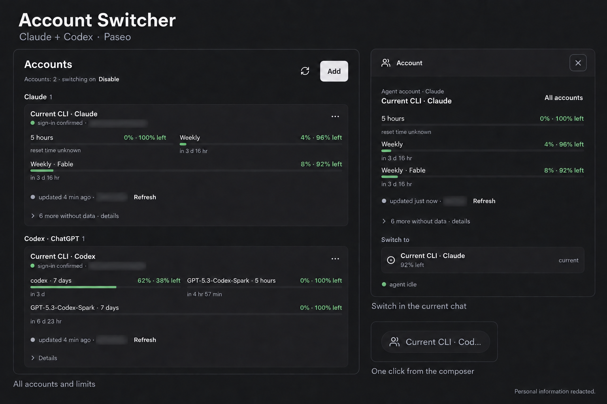

# Account Switcher for Paseo

Use multiple Claude and ChatGPT/Codex subscription accounts in Paseo. Choose an account for each agent, switch within an existing chat, and see limits across your saved accounts.



- **Sign in from Paseo.** Add an account, finish the official provider sign-in, and return to your chat.
- **Switch per agent.** The account chip opens a dialog on desktop or a bottom sheet on mobile. Changes apply only when you choose **Apply**.
- **Keep your setup.** Profiles separate credentials while sharing provider settings, skills, and session history.
- **Track account limits.** See used and remaining percentages, reset times, and freshness for every reported window.
- **Use a default.** Choose the account used by new agents for each provider.

## Requirements

- **Paseo 0.8.x** on a **macOS or Linux** daemon and on the connected client.
- **Node.js 22.12.0 or newer**, with npm.
- Official **Claude Code**, **Codex**, and **Paseo** CLIs available to the daemon. Both provider CLIs must be installed, even if you initially use only one.
- Claude or ChatGPT subscription authentication. API keys and custom authentication/provider overrides are unsupported.

The interface is in English. Reset dates use the viewing device's local time zone. See [installation](docs/installation.md) for remote hosts and [verification](docs/verification.md) for the scope of recorded testing.

## Quick start

Install from Git on a compatible daemon:

```sh
paseo plugin install dutchakdev/paseo-plugin-account-switcher --host 127.0.0.1:6767
```

Paseo downloads the source and runs the manifest's dependency and build steps.
To review or develop the source first, use a local checkout:

Download or clone this repository onto the **daemon's machine**, then run these commands from its directory:

```sh
npm ci --ignore-scripts --legacy-peer-deps
npm run build
npm run typecheck
npm test
paseo plugin install "$PWD" --host 127.0.0.1:6767
paseo plugin ls account-switcher --host 127.0.0.1:6767
```

1. In Paseo, enable **Settings → Plugins → Enable plugins** if needed. Plugins are trusted, unsandboxed code with access to the daemon user's files, processes, credentials, and network.
2. Confirm that `account-switcher` is **running**. Open **Accounts** in the sidebar, or **Accounts and limits** in the Command Center.
3. Your existing **Current CLI · Claude** and **Current CLI · Codex** profiles appear automatically. They use the daemon's existing CLI authentication.
4. Select **Enable** in Accounts to turn on account switching. This saves the original provider commands and installs the plugin's launchers.

The example targets the local daemon at port `6767`. For a different daemon, follow the [host-specific installation steps](docs/installation.md#remote-daemons).

## Add an account

Select **Add**, choose a provider, name the account, and select **Add and sign in**. The official CLI runs in the background; the plugin opens a sign-in dialog without creating a terminal or workspace.

| Where you use Paseo | How to open sign-in |
| --- | --- |
| Desktop app | The dialog tries to copy the link. Paste it into your usual browser; **Copy link** retries copying. |
| Web or native mobile client | The dialog tries to open the browser. **Open browser** and **Copy link** remain available. |

If clipboard access is unavailable, expand **Show sign-in link** and copy its selectable text.

- **Claude:** finish on the provider's page. If it gives you an authorization code, paste the **complete code, including the part after `#`**, into **Authorization code** and select **Finish sign-in**.
- **Codex — Device code:** enter the displayed code on the provider's page. This is the choice for a phone or another computer. **Copy code** copies it.
- **Codex — Browser:** finish in a browser on the **daemon's computer**. The callback uses localhost. From another device, cancel and choose **Device code**.

The plugin verifies the identity and refreshes limits automatically. **Check sign-in** in the account's **⋯** menu provides a manual check. Enter passwords only on the provider's official page.

Closing the dialog leaves **Continue sign-in** on the account. **Cancel sign-in** stops the process before releasing the profile. While sign-in is active, the account cannot be applied, made the default, or deleted. A failed start leaves the account available for **Retry sign-in** without creating a duplicate. Plugin reloads stop pending sign-ins; start again afterward.

### Manage accounts

The **⋯** menu contains refresh, check sign-in, default, sign-in, rename, and delete actions. Account rows show identity, default status, and counts of current and pending agents.

Before signing in again, switch agents away from that profile. To delete a managed account, clear its default and all current or pending selections first. Deletion requires confirmation. **Archived agents retain their account binding for resume**; restore and switch them before deleting the account. System profiles cannot be deleted.

## Switch an existing chat

1. Select the account chip beside the message field to open **Account** over the current chat.
2. Under **Switch to**, choose a verified account from the **same provider**. The existing account stays marked **current**; the selected account is **pending**.
3. When the agent is idle and has no pending permission request, select **Apply “name”**.

You can select an account during a response, but it is **never applied automatically**. **Cancel selection** clears it. **All accounts** opens the full account list.

Apply reloads the agent through Paseo while preserving its native session ID. The plugin confirms the new account only after startup confirmation and successful reload. If a switch fails, it attempts to restore the previous account. **Account not confirmed** means the running account could not be established; select an account and apply again.

Different agents can use different accounts in parallel. Avoid sending from another client during Apply: Paseo's native reload has no atomic lock against a concurrent message, which could be interrupted.

## Read limits

Each account shows all reported limit windows, including zero usage. Measured windows show used and remaining percentages and a reset countdown. Expand details for exact local reset times, durations, fetch/check timestamps, and windows without data.

- Checks run every **5 minutes** in the background and every **60 seconds** while Accounts or the switcher is open.
- **Refresh** requests new data for one account; the header refresh action covers all accounts. Provider retry delays still apply.
- Color thresholds are **80%**, **95%**, and **100%** used. Missing data stays **No data**, never an invented zero.
- Failed requests can retain the last confirmed values as **stale**. Required sign-in, errors, and freshness remain visible.
- A passed reset time triggers a new check; it does not imply that usage is already zero.

Monitoring sends no model messages. The official CLIs own authentication and token refresh; a native Codex limits request may refresh its token. See [monitor details](server/usage/README.md) for scheduling, identity verification, and cache behavior.

## Update or remove

For a directory installation, update its source and run:

```sh
npm ci --ignore-scripts --legacy-peer-deps
npm run build
npm run typecheck
npm test
paseo plugin reload account-switcher --host 127.0.0.1:6767
```

Before disabling or removing the plugin, select **Disable** in Accounts to restore the original provider commands. Removal does not delete the separately stored account data. See [update and removal](docs/installation.md#update) for complete steps, Git installations, and recovery.

## Scope

This project supports manual, same-provider switching with subscription accounts. Automatic account rotation, API-key authentication, and Claude-to-Codex transfers are outside its scope. Provider authentication and limit formats can change with CLI versions; unsupported data is shown as unavailable.

Automated tests cover the implementation with synthetic accounts and provider responses. They do not establish real A → B → A switching, compaction, child-session behavior, or rewind for your accounts. Recorded checks and remaining live verification are in [verification](docs/verification.md).

## Documentation and contributions

- [Installation, updates, and troubleshooting](docs/installation.md)
- [Architecture, profile isolation, and stored data](docs/architecture.md)
- [Contributing and running checks](CONTRIBUTING.md)
- [Paseo plugin reference](https://paseo.sh/docs/plugins/v0.8/reference)

Licensed under the [MIT License](LICENSE). See [third-party notices](THIRD_PARTY_NOTICES.md) for bundled dependencies.
