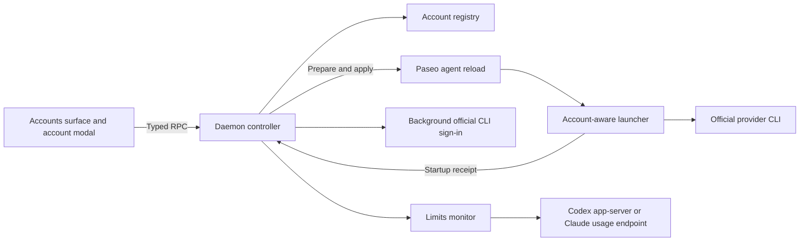

# Architecture and data

[Back to the README](../README.md)

Account Switcher is an independent plugin for Paseo 0.8.x and 0.9.x, including beta releases. It uses public plugin and provider APIs; no Paseo core patch is required.

## Runtime boundaries

- `index.client.tsx` and `client/` provide React Native UI, host-themed components, the composer chip, and the host's modal. TanStack Query caches are scoped to the selected daemon.
- `index.server.ts` and `server/controller.ts` register RPCs and agent lifecycle hooks. The controller owns profiles, login reservations, switching, integration, and monitoring.
- `shared/contracts.ts` defines validated RPC inputs, outputs, and public state. It does not import client or server runtime code.
- `server/launcher-main.ts` is bundled into a standalone Node launcher by `npm run build`. The generated `server/launcher-artifact.ts` is a build output, not a file to edit.

Plugins run with the daemon user's permissions. An account profile separates authentication; it is not an operating-system sandbox. Settings and session data are intentionally shared.

## Accounts and profiles

Each provider has a **system** account that references its existing CLI home and a set of plugin-managed accounts with separate homes. System accounts cannot be deleted. Ordinary settings are sourced from the provider home saved during command discovery, including supported `CLAUDE_CONFIG_DIR`, `CLAUDE_SECURESTORAGE_CONFIG_DIR`, and `CODEX_HOME` paths.

| Provider | Isolated per managed account | Shared with the source profile |
| --- | --- | --- |
| Claude | Credentials, OAuth identity metadata, and the profile-specific macOS Keychain namespace | Ordinary settings and MCP configuration; skills, commands, agents, plugins, rules, instructions, `projects`, and `file-history` |
| Codex | File-based `auth.json` and OAuth identity metadata | Ordinary configuration and instructions; skills, rules, memories, plugins, sessions, archived sessions, writer locks, temporary session data, and SQLite home |

Shared directories use links; selected configuration files are copied or merged when preparing a profile. Unchanged contents are not rewritten. Claude's profile-local project trust and history metadata are preserved while ordinary shared configuration is merged.

Managed environments remove authentication overrides and select the intended home. Conflicting API-key, provider, or endpoint settings are rejected. Missing or redirected managed homes fail rather than falling back to another account.

## Integration and switching

Enabling integration saves the original Claude and Codex commands and configures Paseo to invoke the plugin's launchers. Discovery resolves the real CLI first, so launchers do not recursively invoke themselves. The plugin checks command ownership again at runtime. External command changes disable integration and invalidate outstanding startup tokens; restoring the wrapper path alone does not re-enable it.

An agent binding records its confirmed current account separately from its pending selection and requested launch account. **Prepare** changes only the selection. **Apply** verifies identity and idle state, reserves a launch token, and invokes `paseo agent reload` against the same daemon.

The launcher chooses the assigned profile and writes a startup receipt containing the matching account and launch token. The controller confirms the switch only after reload succeeds and the receipt matches. Failure triggers an attempt to restore the previous profile. A failed rollback or interrupted switch leaves the account unconfirmed instead of displaying an assumed account.

A provider default is assigned during interactive agent creation. Its binding starts unconfirmed until startup is observed. Existing agents keep their bindings. Archived agents retain theirs for resume; cleanup of deleted agents requires a complete, successful agent listing.

Native reload preserves the native session ID, but does not offer an atomic idle-and-reload operation. Concurrent messages from another client remain a race that callers must avoid. Real switching, compaction, child sessions, and rewind require live acceptance beyond synthetic tests.

## Sign-in

The daemon runs the official provider CLI under the managed profile. Claude uses its native subscription login; Codex uses app-server login with browser or device-code mode. The plugin accepts only the expected official authorization URL formats and keeps temporary links and codes in memory.

A persisted reservation prevents another sign-in or account switch while a process may still use the profile. Completion requires the matching process receipt and an identity check. Cancel stops the process before releasing the reservation; uncertain termination keeps the account reserved for recovery. Reload cleanup stops active sign-ins.

The UI uses the public host modal and clipboard API. In the Electron desktop app, it keeps the Paseo 0.8-compatible copy-link flow: users paste the link into their ordinary browser. Web uses a new browser tab; native mobile uses React Native Linking. Automatic opening or copying is best effort, with explicit buttons and selectable text as fallbacks. Codex browser callbacks require a browser on the daemon machine; device-code login works from another device.

## Limits and identity

The monitor checks every account every five minutes. A visible UI renews a 90-second lease, reducing the interval to 60 seconds. A passed reset time schedules another check without fabricating new values. At most two account workflows run concurrently, with one per account. Provider backoff applies to manual refresh too; `Retry-After` takes priority and other retries increase to a maximum of 30 minutes.

Codex limits come from a short-lived official app-server process using `account/read` and `account/rateLimits/read`. Claude uses the OAuth usage endpoint with the selected profile's credentials; on macOS, it follows that profile's Keychain/file precedence. No collector creates a model turn. Credential refresh is left to the official CLI.

Identity checks bracket collection. The cache can retain stale data only when its identity remains verified; replacement or unknown credentials cannot inherit another account's limits. Restored disk data stays hidden until identity verification. Retry deadlines are in memory and reset when the monitor restarts.

The [monitor reference](../server/usage/README.md) documents credential fingerprints, token rotation, parsing, and scheduling in more detail.

## Stored data

The root is `$PASEO_HOME/account-switcher`, or `~/.paseo/account-switcher` by default. It contains the registry, managed profile homes, generated launchers, startup/sign-in receipts, and the last-success limits cache. Plugin-created directories use `0700`; registry/cache files use `0600`, and launchers use `0700`.

The registry includes account labels, identity metadata, original commands, defaults, and bindings. Access and refresh tokens stay in provider-owned credential storage. They are not returned through plugin RPCs or written to the limits cache. The sign-in RPC exposes only the temporary authorization information needed for that attempt.

Deleting a managed account removes its local profile and its exact Claude Keychain item where applicable. Shared provider history remains. Removing the Paseo plugin installation does not remove this separate data directory. Back it up as private authentication-related data; do not attach it to public issues.
